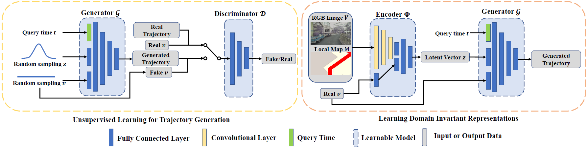
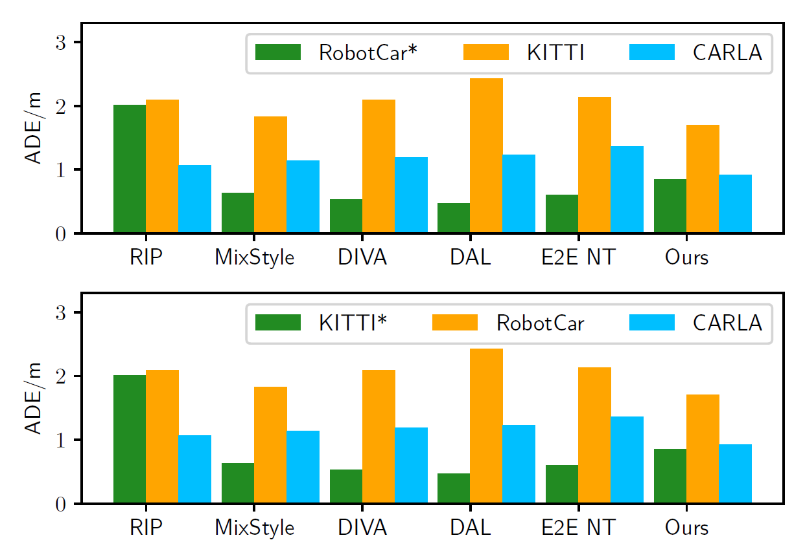
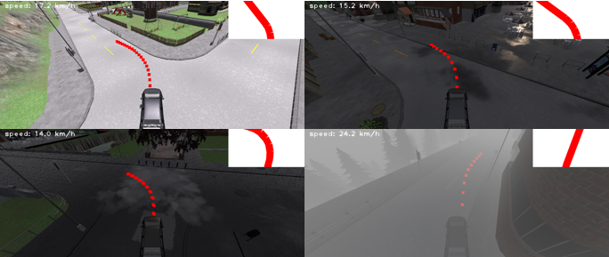
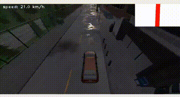
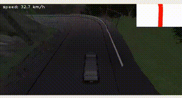
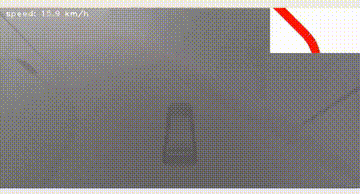

# DG-TrajGen
The official repository for paper ''**Domain Generalization for Vision-based Driving Trajectory Generation'**' submitted to ICRA 2022.

## Our Method

* **Trajectory representation**:
  * Model: ./learning/model.py/Generator
* **Latent Action Space Learning**:
  * Generator model: ./learning/model.py/Generator
  * Discriminator model: ./learning/model.py/Discriminator
  * Training: ./scripts/Ours/train_GAN.py
* **Encoder Pre-training**:
  * Training: ./scripts/Ours/pretrain_encoder.py
* **End-to-End Training**:
  * Training: ./scripts/Ours/train_e2e.py

## Comparative Study
* RIP:
  * Training: ./scripts/RIP/train.py
  * Referenced official code: [github](https://github.com/OATML/oatomobile/)
  * Paper: [arxiv](https://arxiv.org/abs/2006.14911)
* MixStyle:
  * Training: ./scripts/MixStyle/train.py
  * Referenced official code: [github](https://github.com/KaiyangZhou/mixstyle-release)
  * Paper: [arxiv](https://arxiv.org/abs/2104.02008)
* DIVA:
  * Training: ./scripts/DIVA/train.py
  * Referenced official code: [github](https://github.com/AMLab-Amsterdam/DIVA)
  * Paper: [arxiv](https://arxiv.org/abs/1905.10427)
* DAL:
  * Training: ./scripts/DAL/train.py
* E2E NT:
  * Training: TODO
  * Referenced official code: [github](https://github.com/ZJU-Robotics-Lab/CICT)
  * Paper: [arxiv](https://arxiv.org/abs/2010.10393)

## Closed-loop Experiments:
We train the model on the Oxford RobotCar dataset and **directly generalize** it to the CARLA simulation.
* Run: ./scripts/CARLA/run_ours.py

